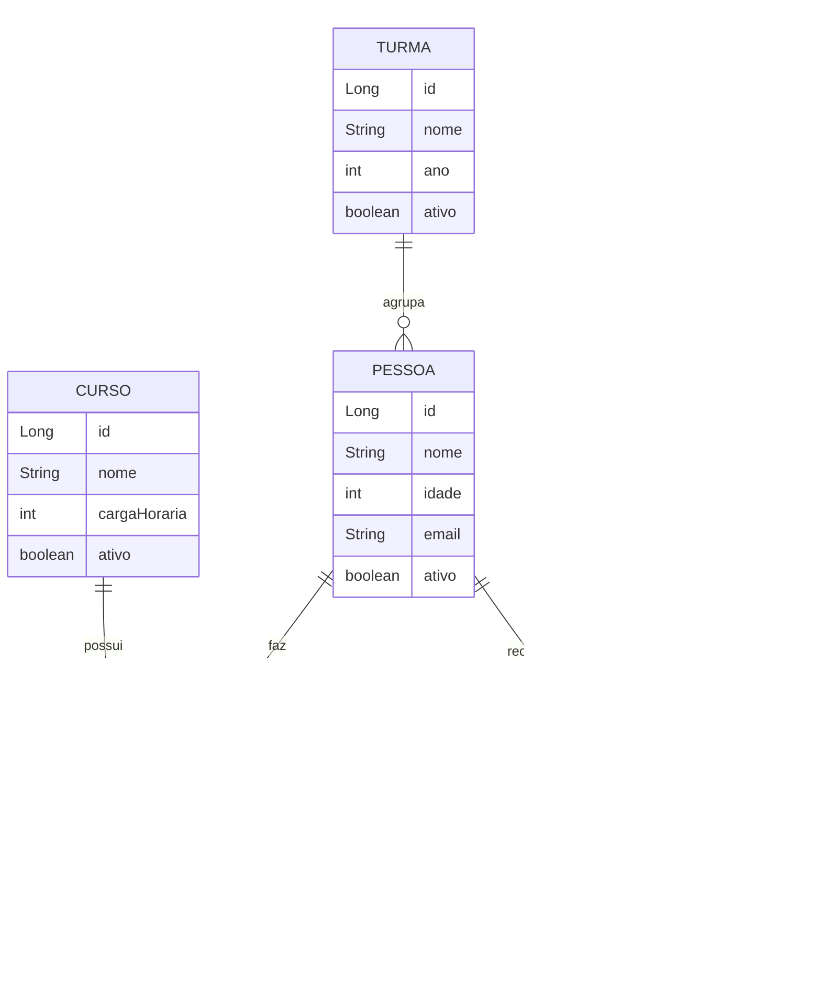

```mermaid
erDiagram
    CURSO {
        Long id
        String nome
        int cargaHoraria
        boolean ativo
    }
    PESSOA {
        Long id
        String nome
        int idade
        String email
        boolean ativo
    }
    PROFESSOR {
        Long id
        String nome
        String especialidade
        String email
        boolean ativo
    }
    DISCIPLINA {
        Long id
        String nome
        int cargaHoraria
        boolean ativo
    }
    TURMA {
        Long id
        String nome
        int ano
        boolean ativo
    }
    MATRICULA {
        Long id
        Long pessoaId
        Long cursoId
        String dataMatricula
        boolean ativo
    }
    AVALIACAO {
        Long id
        Long pessoaId
        Long disciplinaId
        double nota
        String data
        boolean ativo
    }
    
    PESSOA ||--o{ MATRICULA : faz
    CURSO ||--o{ MATRICULA : possui
    PESSOA ||--o{ AVALIACAO : recebe
    DISCIPLINA ||--o{ AVALIACAO : compoe
    TURMA ||--o{ PESSOA : agrupa
    PROFESSOR ||--o{ DISCIPLINA : ministra
```

> O diagrama acima representa as entidades sugeridas para a atividade, com possíveis relações entre elas. Adapte conforme a evolução do seu projeto.
